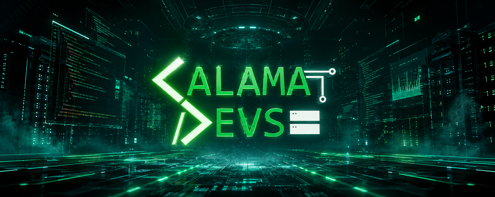
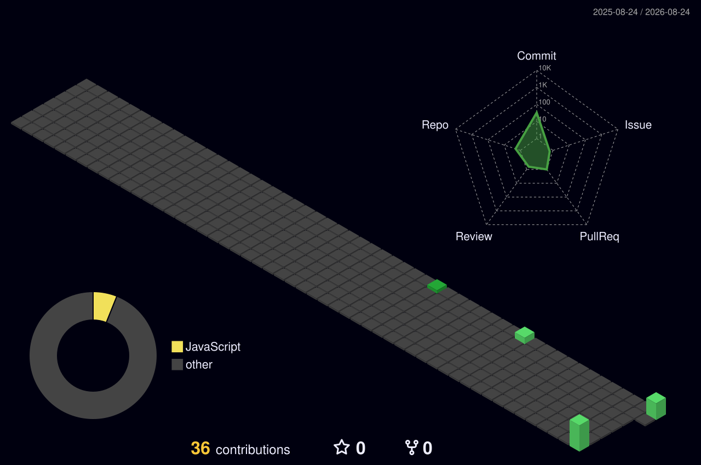

<!-- ================================================================ -->
<!-- IARLEM LACERDA // GITHUB PROFILE COMMAND CENTER                  -->
<!-- ================================================================ -->

<div align="center">



<br>

[](https://git.io/typing-svg)


<br><br>

[`◈ INÍCIO`](#-iarlem-lacerda--developer-profile) •
[`◈ IDENTIDADE`](#-identity-file) •
[`◈ ARSENAL`](#-technology-arsenal) •
[`◈ CALAMA DEVS`](#-calama-devs--experiência-em-equipe) •
[`◈ TELEMETRIA`](#-developer-telemetry) •
[`◈ CONTATO`](#-estabelecer-conexão)

</div>

---

# ⚡ IARLEM LACERDA // DEVELOPER PROFILE

<table>
  <tr>
    <td width="58%" valign="top">

### `> WHO_AM_I`

Sou estudante de **Análise e Desenvolvimento de Sistemas** e **Desenvolvedor Júnior voluntário no Calama Devs**. Minha missão é transformar problemas reais em sistemas funcionais, seguros e bem construídos.

Atuo entre o **back-end e o front-end**, explorando Java, aplicações web, bancos de dados, APIs, testes e cibersegurança. Gosto de entender o sistema inteiro — da primeira linha de código até o deploy.

```text
┌──[iarlem@devbob]─[~/mission]
└─$ build --future --with-impact

[✓] Código que resolve problemas reais
[✓] Evolução contínua e trabalho em equipe
[✓] Segurança desde a primeira decisão
[✓] Curiosidade para dominar o sistema inteiro
</td> <td width="42%" align="center" valign="middle">

</td> </tr> </table> <div align="center"> <a href="https://portfolio.iarleylacerda14.workers.dev/">  </a> <a href="https://github.com/iarlem8?tab=repositories">  </a> </div> <br> 
🧬 IDENTITY FILE
package dev.iarlem.profile;

import java.util.List;

public final class IarlemLacerda extends Developer {

    private final String role = "Desenvolvedor Júnior";
    private final String community = "Calama Devs";
    private final String degree = "Análise e Desenvolvimento de Sistemas";

    private final List<String> currentFocus = List.of(
        "Java & Back-end",
        "Aplicações Web Full Stack",
        "APIs & Banco de Dados",
        "Cybersecurity",
        "Qualidade, testes e deploy"
    );

    @Override
    public Future execute() {
        return learn()
            .then(this::build)
            .then(this::test)
            .then(this::improve)
            .deploy();
    }
}
<div align="center">
CORE	MISSÃO	MODO DE OPERAÇÃO
☕ Java + Web	Criar tecnologia com impacto real	Aprender → Construir → Testar → Evoluir
🔐 Segurança	Sistemas confiáveis e úteis	Curiosidade + disciplina + colaboração
🚀 Full Stack	Dominar o fluxo completo	Código limpo + entrega contínua
</div> 
🛡️ TECHNOLOGY ARSENAL
<div align="center">
LANGUAGES // FRAMEWORKS // RUNTIME

DATA // INFRASTRUCTURE // ENGINEERING

<br>


</div> <details> <summary><strong>⚙️ ABRIR MATRIZ DE COMPETÊNCIAS</strong></summary> <br>
Camada	Tecnologias e práticas
Back-end	Java, PHP, Node.js, APIs REST, autenticação e regras de negócio
Front-end	TypeScript, JavaScript, React, Next.js, HTML e CSS
Mobile	Kotlin, Android e integração com APIs
Dados	MySQL, PostgreSQL, modelagem e persistência
Qualidade	Git, GitHub, testes, revisão, depuração e documentação
Infraestrutura	Cloudflare, Docker, Linux, CI/CD e deploy
Segurança	Boas práticas, validação, autenticação e proteção de dados
</details> 
🌐 CALAMA DEVS // EXPERIÊNCIA EM EQUIPE
<table> <tr> <td width="34%" align="center" valign="middle"> <a href="https://github.com/Calama-Devs">  </a> <br><br>  </td> <td width="66%" valign="top">
> TEAM_CHANNEL_CONNECTED

No Calama Devs, participo de uma comunidade formada por estudantes de ADS que desenvolvem soluções em equipe e enfrentam desafios próximos da realidade profissional.

Minha atuação envolve implementação de funcionalidades, correções, testes, análise de tarefas, versionamento e colaboração no desenvolvimento de sistemas. É onde conhecimento acadêmico se transforma em experiência prática.

Conexões ativas: colaboração • Git Flow • issues • pull requests • testes • entrega

<a href="https://github.com/Calama-Devs">  </a> </td> </tr> </table> 
📡 DEVELOPER TELEMETRY
<div align="center">  </div>
🏙️ CONTRIBUTION CITY // 3D LIVE MAP
<div align="center"> 

<sub>Mapa tridimensional atualizado automaticamente pelo GitHub Actions.</sub>

</div> 
🛰️ ESTABELECER CONEXÃO
<div align="center">
TRANSMISSION CHANNELS: READY

Quer conhecer meu trabalho, acompanhar minha evolução ou construir algo comigo?

<br> <a href="https://portfolio.iarleylacerda14.workers.dev/">  </a> <a href="https://github.com/iarlem8">  </a>

<br><br>

╔══════════════════════════════════════════════════════════════╗
║  CONNECTION ESTABLISHED                                     ║
║  "O próximo nível começa onde a zona de conforto termina." ║
║  while (alive) { learn(); build(); secure(); improve(); }    ║
╚══════════════════════════════════════════════════════════════╝
 </div> <!-- END OF TRANSMISSION -->
